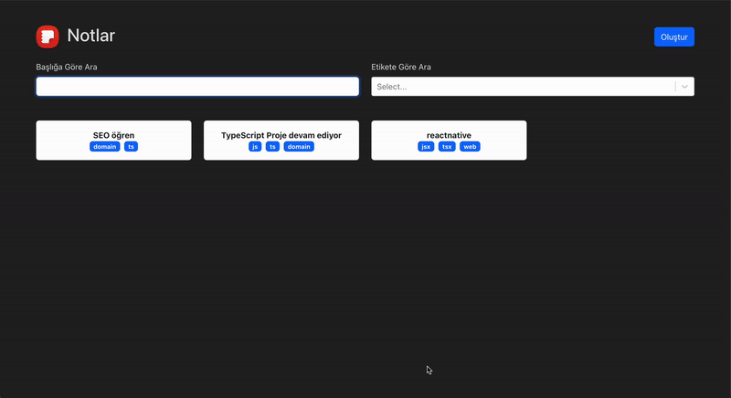
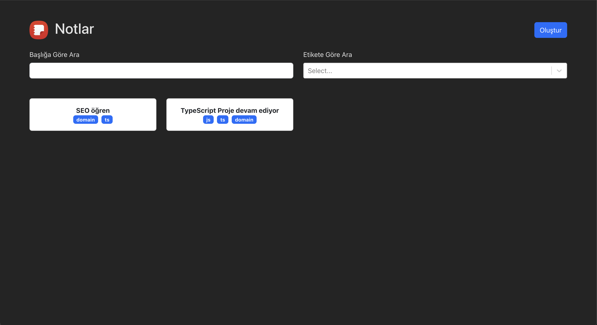
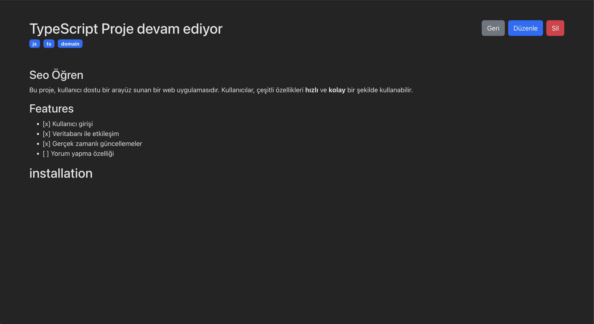
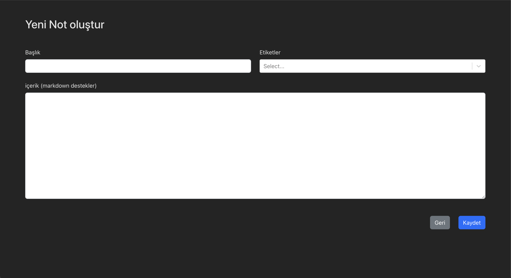

# Notes App

This project is a CRUD application developed to utilize various TypeScript features. It allows users to create, edit, view, and delete notes. The application is built using **React** and **Vite**.

## Video gif



## Main Page



## Detail Page



## Create Page



## Features

- **Home Page**: Filter notes by title and tags.
- **Detail Page**: View the details of notes.
- **Edit Page**: Edit existing notes.
- **Create Page**: Add new notes.
- **Markdown Support**: Notes in the text area are rendered using the `react-markdown` library for improved readability.
- **Responsive Design**: The application is fully responsive, providing a user-friendly interface.
- **Bootstrap Integration**: A sleek design is achieved using `react-bootstrap` for styling.

## Libraries Used

- `@uidotdev/usehooks`: ^2.4.1
- `bootstrap`: ^5.3.3
- `react`: ^18.3.1
- `react-bootstrap`: ^2.10.5
- `react-dom`: ^18.3.1
- `react-markdown`: ^9.0.1
- `react-router-dom`: ^6.27.0
- `react-select`: ^5.8.1
- `uuid`: ^9.0.0

## Installation

To run this project on your local machine, follow these steps:

1. Clone the repository:

   ```bash
   git clone https://github.com/ozerbaykal/note-app-TypeScript.git
   ```

2. Navigate to the project directory:

   ```bash
   cd note-app-TypeScript
   ```

3. Install dependencies:

   ```bash
   npm install
   ```

4. Start the application:
   ```bash
   npm run dev
   ```

<h2>Contributing</h2>

Contributions are welcome! Please open an issue first to discuss what you would like to change.

- 1.Fork the project
- 2.Create your feature branch (git checkout -b feature/NewFeature)
- 3.Commit your changes (git commit -m 'Add new feature')
- 4.Push to the branch (git push origin feature/NewFeature)
- 5.Open a Pull Request

<h2>Contact</h2>

Özer BAYKAL mail : baykalozer87@gmail.com

Project Link: https://github.com/ozerbaykal/note-app-TypeScript
